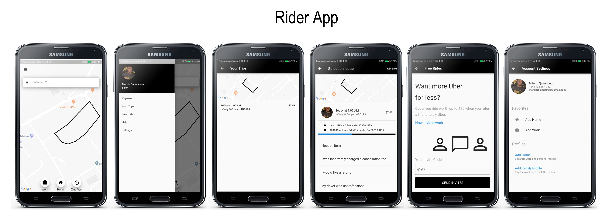

# UBER CLONE MADE WITH FLUTTER + FIREBASE

### ScreenShots

 

 

# Pull Requests
 I welcome and encourage all pull requests. It usually will take me within 24-48 hours to respond to any issue or request. 
 
### Show some :heart: and star the repo to support the project or :smile:[Follow Me](https://github.com/marcioquimbundo).Thanks!
     
